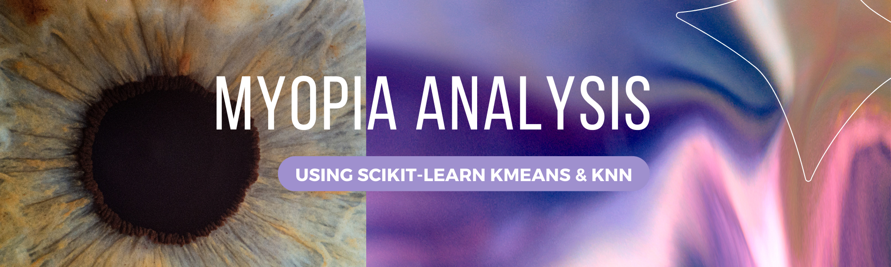
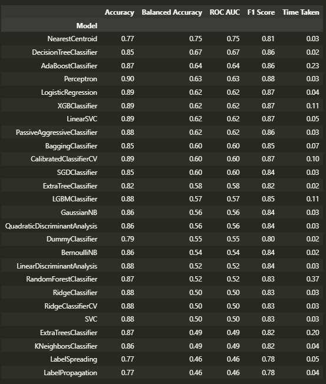

# ml-myopia

Author:  Erin James Wills, ejw.data@gmail.com  

  

<cite>Photo by <a href="https://unsplash.com/@v2osk?utm_source=unsplash&utm_medium=referral&utm_content=creditCopyText">v2osk</a> on <a href="https://unsplash.com/s/photos/eye?utm_source=unsplash&utm_medium=referral&utm_content=creditCopyText">Unsplash</a></cite>

<br>

>Note:  This repo is used for exploring different machine learning techniques. The dataset was selected due to the difficulty of developing a solid model without inappropriately coercing the data.  This is an ongoing project.  

## Overview  
<hr>  

This repo explores multiple machine learning techniques to identify children that may develop nearsightedness.  The initial goal was to only run several models and compare the results but later I decided I wanted to create a multiphase analysis project where I could do the following:
*  Split a dataset with a variety of features into a low, medium, and high variance subsets.
*  Run a series of experiments on each dataset to see which model (feature selection, preprocessing, algorithm selection, tuning, and evaluation metrics) performs the best.
*   The process has currently been processed on a low variance subset with the following steps:
    *  Feature Selection and Cleaning - outlier detection, correlation, VIF feature identification, feature interactions
    *  Data Balancing - sampling techniques, target weighting, evaluation threshold changes
    *  Algorithm Testing - preprocessing (previous steps), feature reduction, hyperparameter tuning, model evaluation, overfitting adjustments 
    *  Test-train-split Evaluation - the best model is used to determine if the original splits are appropriate.  The model was run on various subsets of data to determine the model variance versus train and test split sizes.  The best split is used to re-run the models and monitor the effects.   

Project status:  Most of the experimenting on the low variance dataset is complete and the code is being refactored and modified to use pipelines. In the future, several of the methods used will be tested on synthetically generated data that will represent different ways data can vary - this will help verify best practices with test-train-split selections, data balancing, hyperparamter turning, and evaluation.     

## Limitations

The dataset is a subset from the `Orinda Longitudinal Study of Myopia (OLSM)` study.  Having the entire dataset covering the entire range of measurements would be interesting especially when determining the rate of change in SPHEQ.  Although this is an interesting problem, analyzing the data over time would probably be a better method than the snapshot in time provided.  

> For information about the reasons I selected this dataset and the scope of the project, please read my [project scoping document](./docs/scope.md).

   
<br>  

## Technologies    
*  Python
*  Scikit-Learn
*  TensorFlow
*  Imbalanced-Learn
*  Google Colaboratory
*  FLAML AutoML by Microsoft

<br>


## Data Source  
Reduced dataset from [Orinda Longitudinal Study of Myopia conducted by the US National Eye Institute](https://clinicaltrials.gov/ct2/show/NCT00000169)

This study observed children starting from about 5 to 9 years old for a period of six years.  The data in the subset appears to be data collected upon their initial enrollment in the study and whether the subject developed myopia during the 6 year timeframe.  Myopic was defined as when a subject has a spherical equivalent refraction (SPHEQ) measurement of less than -0.75D.  It should be noted that initial SPHEQ was recorded but changes in this variable over time were not included nor was the date when the subject was verified as having myopia.

<br>

## Process  

Overall I am trying to find the right combination of data preparation, algorithm selection, and algorithm tuning to make the best model possible.  For full details of my process then see the [process writeup](./docs/process.md).

<br>

## Analysis  

### Exploratory Data Analysis

> For more information about the feature selection, see my [notes](./eda/exploratory.md) or read the notes and summaries from the [notebooks](./eda/)

*  For this analysis I decided that it would be fine to work on a highly filtered dataset and then redo the process several times with more variation in the data with each iteration.  
*  The final dataset has data of only 6 year olds and about 372 records after removing records that may be considered outliers (extreme cases), special cases, or faulty data.
*  Of the available features, I selected to use `SPHEQ`, `SPORTHR`, `DADMY` and `total_positive_screen` as signficant features and I also included `ACD`', `LT`, and `VCD` for future experiments.  All the testing I performed indicated that the same variables were important.  I should also note that in my future analyses that I used `delta_spheq` instead of `SPHEQ` but the two are very similar.  The label or target is `MYOPIC`.
*  Interacting features could be `AL` since it's partial dependence plot showed some positive and negative results.  `SPHEQ` is also an interesting variable but it will be left in the dataset.  

### Data Balancing
> The dataset is 13% myopic cases.  This is fairly significantly imbalanced.  

> For more information about the data balancing experiments, see my [notes](./data-balancing/balancing.md) or read the notes and summaries from the [notebooks](./data-balancing/)

__Balancing Effect on Distributions__ 
*  SMOTE or ADASYN seem to work the best when balancing but with this dataset the integrity of the distribution is largely maintained so there are no major distortions when using the other tested methods.  Dataset size is the main issue so undersampling may cause problems.   

__Model Performance using Weighted Targets__ 
*  Oversampling techniques seem to have a greater influence than using the RandomForest balancing feature.  By applying SMOTE or ADASYN and then setting the algorithm to further balance the target if any imbalance exists might better fine tune the model. 

__Classifier Threshold Effect on Precision and Recall__ 
*  For parametric algorithms, adjusting a binary classifiers threshold can have significant effects since it changes the precision and recall balance.  This can be a significant change but needs to be done sensibly and with the context of the problem and goal in mind.   I tested this idea with an SVC algorithm (linear).  This could be a practical step in the model selection step but I would need more data to evaluate its broader reliability (with untrained data).    
```I should do this test with random forest classifier (even though it is not parametric) so I can compare to other tests I have done; the effect of thresholds should still exist but I need to think about what this means with models that are not parametric.```

__Imbalance Effects on Tree Models__ 
*  Often tree based models like RandomForests can have siginficant differences compared to the other models.  After looking at four different algorithms with and without SMOTE balancing, I found that BalancedRandomForest to provide good results except for precision.  I question how it's undersampling is effecting the model but there is not an immediate method that exists to access the data it uses after undersampling - `I will need to delve into the source code`.  This algorithm might be favoring recall intentionally over precision.  The key take-away of this analysis is that trees are sensitive to imbalances and balancing and bagging greatly increase the models predictive abilities.  I would say that I also like RandomForest with SMOTE balancing as a model.   

<br>

### Classification    

> For more information about the models, see my [notes](./classification/models.md) or read the notes and summaries from the [notebooks](./classification/)

*  A variety of models were run and more are being added as time permits.  More models can be found within the `data-balancing` folder.  Those models were specifically testing the effects of imbalanced data.  The contents of this folder are files testing a variety of models.
*  As an experiment, I tested the LazyClassifier library but I am not yet confident in its use.  I prefer to use the models directly from scikit-learn since I understand the interworkings better.  This library returns the results of many models in a nice table format.  I use it to guide what models I might want to explore in detail.  The file is named `model-multimodel-compare.ipynb` and is found in the `classification-automl` folder.  
*  KNN, SVC (linear) and ANN were other models tested along with methods to improve the model like PCA feature reduction and hyperparameter tuning.  
*  I should also point out that I used Microsoft's FLAML library which is a automl library.  This tool suggested using LightGBM Classifier.  This is a tree algorithm.  I also tested other methods like XGBoost.  

<br>

### Clustering

> For more information about clusting, see my [notes](./clustering/groups.md) or read the notes and summaries from the [notebooks](./clustering/)

Currently, I have only surveyed clustering techniques with this dataset.  I have mostly been testing the effect of using PCA to reduce the features and t-SNE to visualize the data in 2-D.  These experiments are in their early stages.  

<br>

##  Conclusion  

Due to the small data size and the significant target imbalance, there are definite limits of what can be predicted and in many ways some attempts are a bit futile for machine learning.  With that being said, I did find the [scikit-learn suggestions](https://scikit-learn.org/stable/_static/ml_map.png) to be good heuristics.  This was the starting point for my exploration where I began using models like SVC, RandomForest, and KNN.  As I ventured further then I found several different types of ensemble tree models to produce reasonable results.  

In the end of this process (on the highly filtered, small dataset), I found that the test-train-split ratio should be closer to 50/50 than 75/25.  The data should be balanced with a process like SMOTE.  Linear SVC doesn't work well but a tree method showed more promise.  Using a model that has built-in target weighting can have marginal effect but balancing the model and tuning can have much more significant effects.  In the end using an ensemble tree method like LightGBM Classifier worked the best.  This model has the potential of scoring 50% on precision and 50% on recall.  Other models, showed results in the mid-40's on precision and lower for recall.  

I won't refine my answers until I run some experiments on synthetically created datasets so I can ascertain the quality of the model given different types of known difficult data.  The key to this experiment is that I will know from the beginning the type of difficulties I am introducing and the ensuing outcomes.  **`As you can guess, I don't like relying on heuristics.`**


<br>

## Setup and Installation  
1. Environment needs the following:  
    *  Python 3.6+  
    *  pandas  
    *  scikit-learn
    *  imb-learn  
    *  flaml (no installation needed; use Google Colab)
    >  I am using conda to manage my environment
    >To install imb-learn:  `conda install -c conda-forge imbalanced-learn`
1. Clone the repo to your local machine
1. Activate your environment in that directory  
1. Open a Jupyter Notebook   
1. Run any of the notebooks in these folders:  
    *  `eda`
    *  `data-balancing`
    *  `classification`
    *  `clustering`
    > The notebooks are commented and a markdown file in each folder has additional commentary.  

## Create Environment for LazyClassifier
In gitbash or terminal, perform the following commands:
1.  Type `conda create -n PythonML python=3.6 anaconda`
1.  Type `conda install -c anaconda nb_conda_kernels`
1.  Type `conda install -c conda-forge/label/cf202003 nodejs`
1.  Type `pip install scikit-learn==0.23.1`
1.  Type `pip install sklearn-utils`
1.  Type `pip install --upgrade pyforest`
1.  Type `python -m pyforest install_extensions`
1.  Type `pip install lazypredict`  

Note:  I am using Jupyter Lab (might be the reason step 3 is needed). These instructions are needed to run [`classification/model-multimodel-compare.ipynb`](./classification/).


## Examples  

