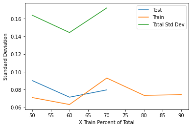
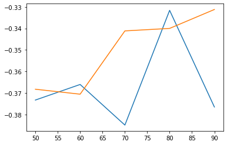
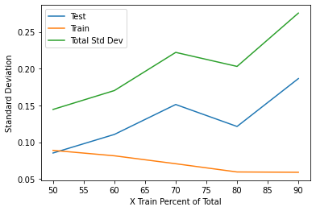

# Dataset Split Effects  

## Overview / Purpose
Many tutorials, textbooks, and videos suggest using data splits for training and testing around 75/25.  The fore mentioned split ratio is the default value used in scikit-learn.  Although this is a nice heuristic, the underlying concept should be understood.  For example, ultimately you want your splits to be representative of your data.  

In the ideal scenario, you have lots of data and whether you choose 75/25, 80/20, or even 95/5 doesn't really matter because the test dataset will be large enough that you will get representative results.  The argument for using 95/5 splits versus 75/25 is probably not very critical except that we are needlessly testing with larger amounts of data.  

An undesireable scenario is that you don't have a lot of data but are still trying to obtain results using the holdout machine learning method.  This scenario may result in no possible results or highly variable results that will be misleading.  

The contents of this folder is to look at ways that we can test if a split is too small.  The process could be used on a large dataset to determine what is an excessively small and large set but I will only use my small dataset for right now.  In the future, I will generate a dataset where I will test this code to validate my thinking.  

The overall concept of this expiriment is to split the same dataset into smaller and smaller datasets and with each dataset run multiple samples on the model.  By finding the mean of the evaluation metric and its standard variation we can determine how similar the results are between the different splits using data subsets (only removing records between splits).  In theory, when the sample size becomes small the variation in the results should increase.  We might also see some noticeable differences in the averaged values but the standard deviation would probably be the better metric to monitor.  

## Process  

Below are the steps used to make the subsets.  I am going to run cross validation on each subset to obtain model results from randomly sampled data.  I will do a similar process on the test data.  There should be an inverse relationship between training and testing variation.  As the training set becomes smaller then the variation increases but at the same time the testing set should result in the variation decreasing.  Is there an ideal split for this dataset?

1.  Test variance of the training split
    *  Make a 90/10 split of train to test
    *  Run model on all training data and collect metrics and variation of the metrics
    *  Split the train set again and again as such:
        *  88.9/11.1  (80% of all data)
        *  87.5/12.5  (70% ..)
        *  85.7/14.3  (60% ..)
        *  83.3/16.7  (50% ..)
2.  Test variance of the testing split
    *  Make a 50/50 split of train to test
    *  Run model on all tresting data and collect metrics and variation of the metrics
    *  Split the test set again and again as such:
        *  80/20        (40% of all data)
        *  75/25        (30% ..)
        *  66.6/33.4    (20% ..)
        *  50/50        (10% ..)

## Analysis   

Here are the results for unbalanced data for a binary classifier where the imbalance is about 7:1.  The results show that at test splits with less than 150 samples often do not have enough samples to predict any of the minority target class. 

The results when the data is balanced using SMOTE show that the test split mean error has a lot more variationbut the range of values is still realtively similar.  

When looking at the standard deviation of the experiment, it is much easier to see that the change in the test splits variation is much greater than the train sets variation.  This indicates that the variation in testing is getting much worse as the training set makes up a larger ratio of the entire dataset.  the best choice here is that we use a 50/50 split or maybe a ratio close to 50/50 like 60/40.  Uisng a ration of 80/20 or greater would greatly increase the variation and the variation of the test set would only have moderate increases.  

## Conclusion  

Based on running the model with the above splits, the test X dataset needs to be at least 150 to 200 samples large to get valid results; although, the results might not be consistent at that low number based on the class imbalance.  In reality the test dataset should probably be a several times larger than this sample size.  Given the data, 200 samples would be about 50% of the data.  I would also conclude for this data set that using 50% to 60% of the data as the train set.  

## References  
The original idea came from this stackoverflow topic that I thought was a nice experiment:  https://stackoverflow.com/questions/13610074/is-there-a-rule-of-thumb-for-how-to-divide-a-dataset-into-training-and-validatio